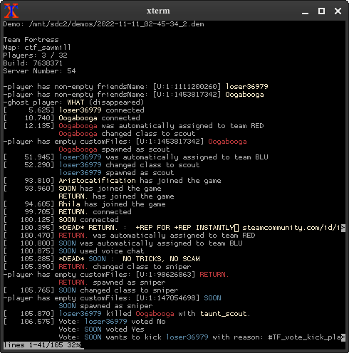
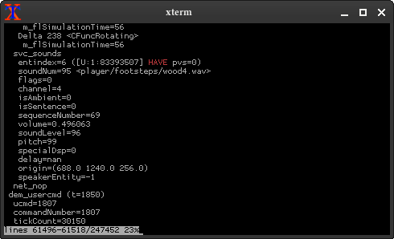

# demoreader

a tf2 demo file reader i wrote without talking to anyone

the code is from 2022, but (to my surprise) it seemed to still work with demos as recent as 2025-11-07

thanks:

- <https://github.com/ValveSoftware/csgo-demoinfo> (basics of demo parsing)
- <https://github.com/UncraftedName/UntitledParser> (more complicated event stuff)
- some glances at leaked source code

### command-line documentation

    ./demoreader [options] [demofile|[start]-[end]]...

The command takes one or more demo files as an argument. Alternatively,
a range can be specified to look them up in the game's demo directory.
See **Range syntax** below.

**Options:**

-   `-color`: 		always colorize output (default: only to terminal)
-   `-pager`:		show output in a pager
-   `-keepgoing`:	when reading multiple demos, don't exit if one has errors
-   `-l`:		don't read, only list found/matched demo files
-   `-live`:		continuously parse a demo currently being recorded
-   `-nowait`:		disable automatic live demo functionality (for scripting)
-   `-steamids`:	include player steamids in output
-   `-trace`:		include detailed low-level output from parsing

**Developer options:**

-   `-debug`:		run with a debug build, recompiling if necessary
-   `-json`:		force writing json file
-   `-livestat`:	print debug stats for -live
-   `-sizestat`:	gather size stat
-   `-userids`:		include player userids in output
-   `-v`:		verbose output (useless)

**Range syntax**

Ranges have three forms:

-   `n-m`: Play numbered demos `n` to `m`. Demo numbering is one-based
    and starts from the oldest demo. **Example:** `1-3` - Play the first
    three demos.
-   `n-`: Play demos starting from the `n`th oldest. **Example**: `5-` -
    Skip four demos from the beginning and read them from the fifth
    onwards.
-   `-n`: Play the `n` most recent demos. **Example**: `-1` - Play the
    single most recent demo.

Here's an illustrated example of the numbering and matching.

    [1] 2025-10-01_17-39-49.dem    (1-3)
    [2] 2025-10-02_11-43-47.dem    (1-3)
    [3] 2025-10-02_11-43-47_2.dem  (1-3)
    [4] 2025-10-03_20-59-43.dem
    [5] 2025-10-03_21-06-38.dem    (5-)
    [6] 2025-10-03_21-06-38_2.dem  (5-)
    [7] 2025-10-03_21-06-38_3.dem  (5-) (-1)

### they JUST announced it

    Date: Fri, 24 Jul 2026 11:32:37 -0700

    JoriKos left a comment (ValveSoftware/Source-1-Games#3477)

    Since June 2024, I believe the 'bot crisis' is pretty much over. There
    are still bot accounts as there have always been, and some of them are
    doing mildly noticeable things (changing the Casual map selection screen
    bars), but I think this issue can be pretty confidently closed. There is
    no more bot crisis, and the remaining bots are nowhere near the amount
    of disruptive bots to call it a 'bot crisis'.
